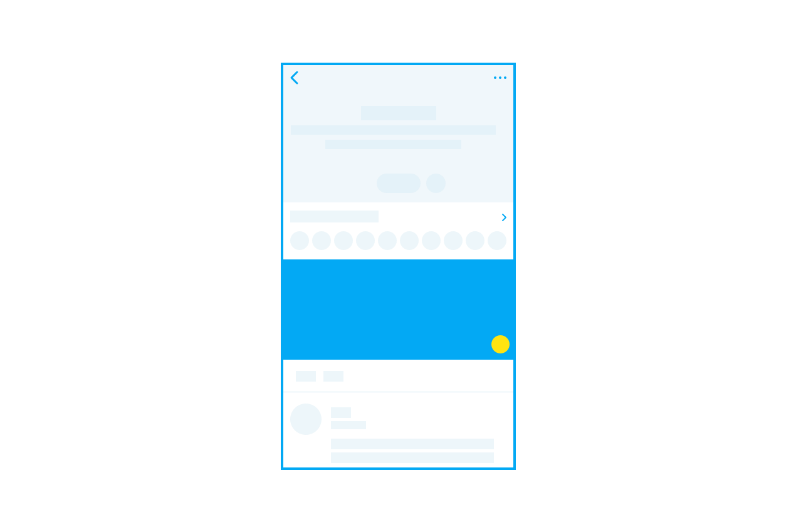
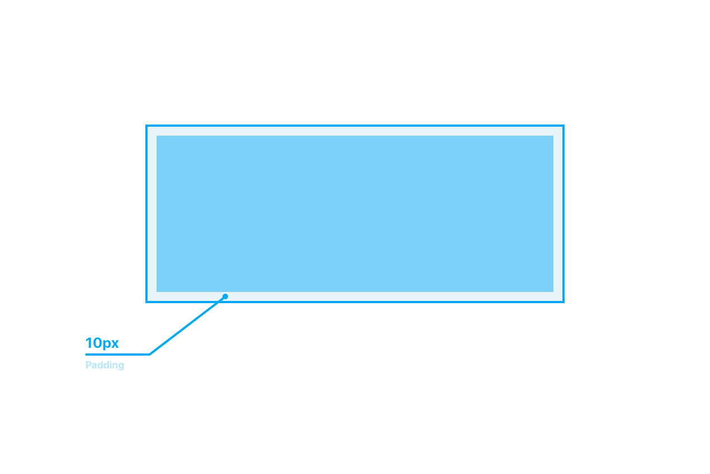
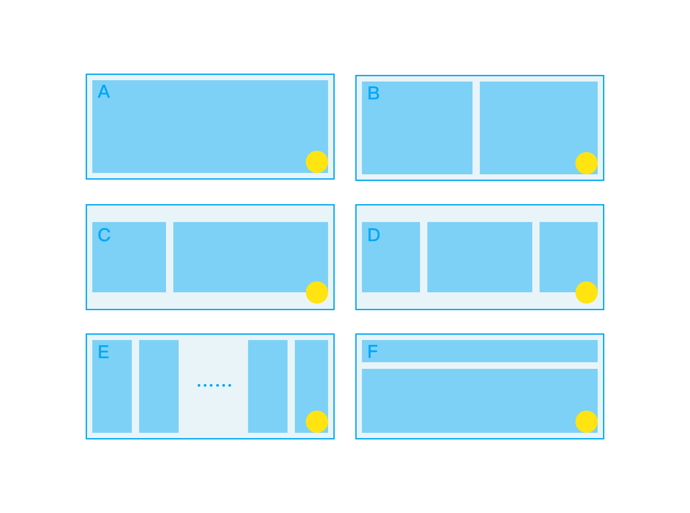

# 主题插件指南

### **位置与尺寸**

主题插件位于主题详情页内，**在主题头部元素下方、消息列表的上方**。

插件宽度为`100%`显示宽度，高度固定为`160px`。为了保证在较宽设备上的良好体验，建议设置一个 `max-width` 。

### 插件设计原则

* **与主题相关。**主题插件的功能和体验需要尽量接近该主题的内容与氛围，以助于即友接受和欣赏它。
* **功能、内容简洁清晰。**由于空间限制，你的插件可能需要注意以下几点： 1、在主题插件中提供**单纯展示类**或者**交互简单**等轻量、及时的功能； 2、尽量避免在插件区域使用弹出框，减少页面的跳转次数； 3、插件内的文案需要尽量简洁。
* **布局合理。**主题插件的主体内容应该全部显示在插件区域，避免裁切。并且整体大致居中，有足够的内外边距。可以根据建议的布局。
* **及时反应，简化交互。**用户的操作需要有比较明确的反馈，减少用户的疑惑与等待。
* 如果需要承载更多更复杂的功能，只要合适，可以将插件作为入口。在用户点击部分意义明确的按钮、或者直接点击插件区域后，跳转到「即刻 Web」。

### 插件设计限制

* **避免滑动手势。**与与全局的手势冲突，在主题插件内不可以使用滑动手势。需要寻找其他方案代替拖动、缩放等功能。
* **注意按钮尺寸**。所有按钮不要小于`30px*30px` ，按钮需要有 Active 状态。
* **减少使用文本框**。减少使用文本框。因为文本输入的体验不太好，请尽量减少输入文本的场景。
* **避免深色背景**。设计时避免使用深色背景，可以使用默认的背景颜色来提供与 App 更一致的体验。
* **禁用自动播放**。为了减少对用户的打扰，插件区域的视频和音乐不可以自动播放。

### 可用区域

插件周围可以保留`10px`的内边距，避免布局过于拥挤。

### 主题插件布局示例

主题插件的横向网格和纵向网格尽量都不要太多，元素间最小的距离为`5px`，并且所有的间距都为 5 的倍数。

可以用以下示例来做快速布局。这些示例不是一种限制，而是一种启发。


图 E 的网格布局，最多不超过五等分。


### 

