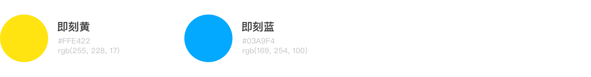

# 设计规范与资源

## 颜色

### 主题色



### 中性色


### 辅助色


即刻的主题色为 Jike Yellow 和 Jike Blue。

中性色请尽量使用色板中提供的颜色。页面内容主要文字为 Grey 1，副文本、提示文本使用 Grey 2，Grey 3 主要用于时间戳、表单的 Placeholder 等位置。Grey 4 用于页面的默认背景。

## 字体

网页的字体与系统字体保持一致，常用的有如下几个样式。


* Heading 系列可以用作标题与页面的首要信息，Heading 2 可以在大按钮中使用，这个系列都应该以单行出现
* Para 1 可以在页面中大面积、连续使用，是页面的主要内容，Para 2 可以用于页面内的次要信息。
* Label 1、Label 2 可以用于页面的辅助内容、超链接、说明内容等。



## 清除部分 CSS 样式

```css
body {
    -webkit-tap-highlight-color: transparent;
}

input, button, textarea {
    outline: none;
    border-radius: 0;
    -webkit-appearance: none;
}
```

## 即刻品牌素材




